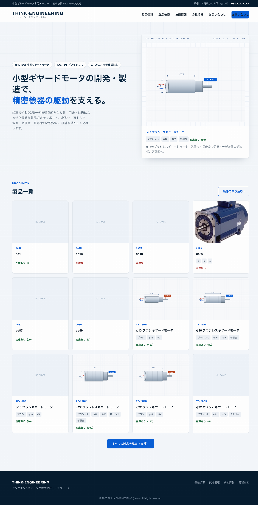
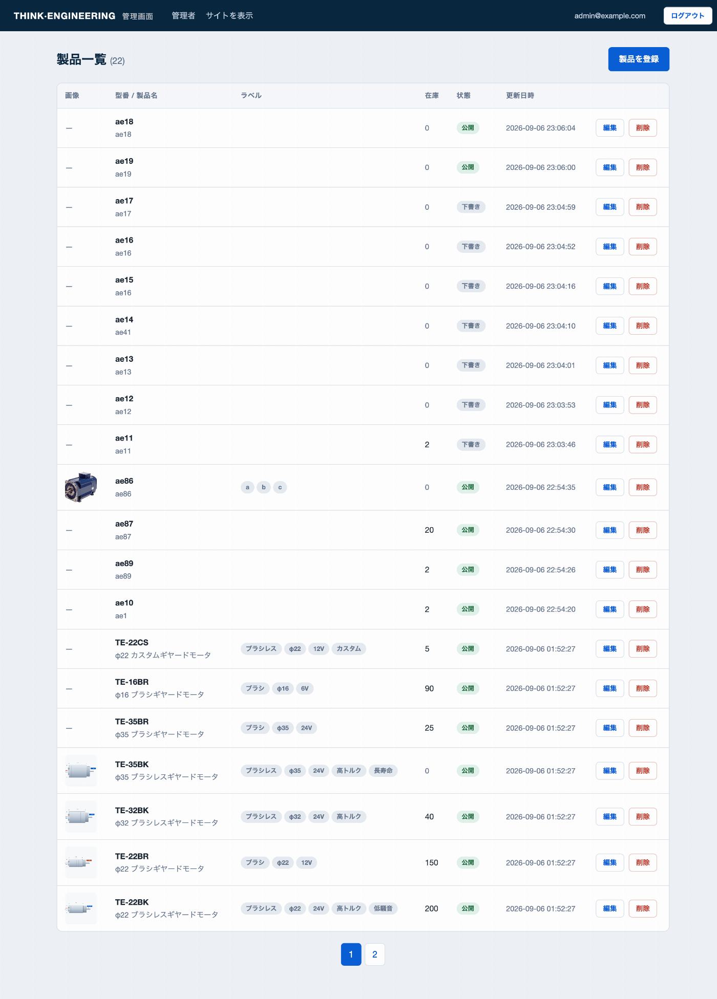

# THINK ENGINEERING — 产品展示网站

一个支持厂商产品展示的网站：前台展示产品目录、支持产品检索；小后台登录后可以新增、编辑、删除产品并上传产品图片。


---

## 1. 本地环境搭建

为了保证部署稳定性和一致性，本项目使用Docker Container。只需要 Docker Desktop，本机不用装 PHP、Node 或 MySQL。

```bash
cd tosho_interview          # 进入项目根目录
docker compose up --build
```

本项目只占用宿主机的 8080 端口；MySQL 仅在 Docker 内部网络可见，不会与本机已有的 MySQL 冲突。8080 被占用时把 `docker-compose.yml` 里的 `"8080:80"` 改成其他端口即可。

首次启动时 MySQL 容器会自动导入 `sql/init.sql`：建表、10 个演示产品（6 个带图）和默认管理员。启动完成后：

| 地址 | 说明 |
| --- | --- |
| <http://localhost:8080> | 首页 |
| <http://localhost:8080/admin> | 小后台，可用 `admin@example.com` / `password123` 直接登录 |

## 2. 页面截图

前台首页：代表产品 + 产品一览



小后台产品列表：分页、状态、编辑 / 删除



---

## 3. 项目架构

```
config/        应用配置、数据库连接、路由表
public/        前后台页面 + API 入口 index.php
sql/           创建数据库 + 导入初始数据
src/           Core基础组件(包含控制器，路由器等) + 后端代码
storage/       图片上传目录与 session 文件
```


---

## 4. 技术要点

1. 前后端分离, php后端只返回 JSON, 不做服务器端渲染

2. Session 保护后台，CSRF token 防跨站请求伪造

3. SQL全部参数化，应用排序白名单，以防 SQL 注入

4. Core 基础组建帮助后端代码提高可维护性和可扩展性

---

## 5. 部署到生产环境的改进方向

- 将图片存储改为:浏览器用预签名URL直传 AWS S3
- 用 Redis 存储 sessionn 数据, 以实现多实例共享 session, 以及 session 的自动过期
- 数据库改为增量 migration：上线后修改不再依赖一次性导入的 `init.sql`

---
